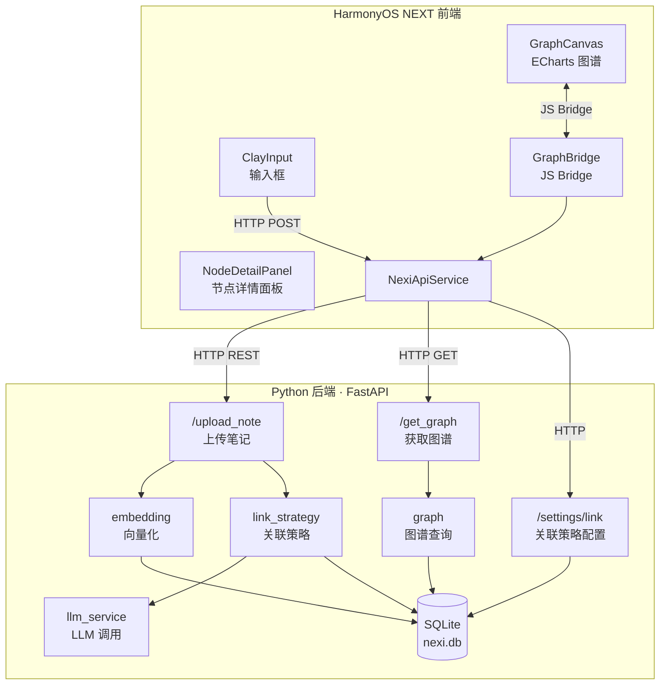
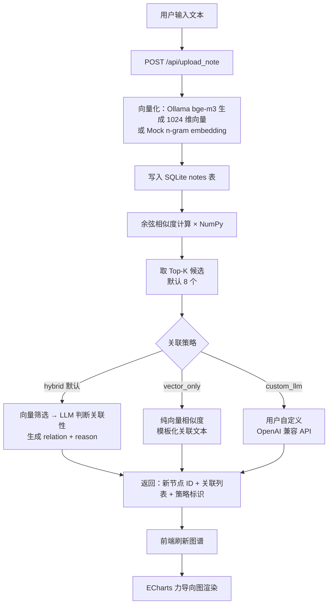
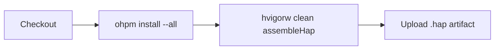

<div align="center">

<h1>灵绪 Nexi</h1>

<p><strong>无边界 AI 知识图谱应用</strong></p>
<p><em>An AI-powered knowledge graph that auto-links your ideas — built for HarmonyOS NEXT.</em></p>

[](https://developer.huawei.com/consumer/cn/harmonyos/)
[](https://www.python.org/)
[](https://fastapi.tiangolo.com/)
[](LICENSE)
[](https://github.com/Jenrimark/Nexi/actions/workflows/ci.yml)

<br/>

> **倒进去就行。** 不用分类，不用打标签。写下想法，灵绪 Nexi 自动理解语义关联，生成可交互的知识图谱。

</div>

---

## App 简介

灵绪 Nexi 是一款面向 HarmonyOS NEXT 的 AI 驱动知识图谱应用。核心理念是 **"倒进去就行"** —— 用户只需输入任意文本，系统自动完成语义向量化、相似度计算和关联分析，以力导向图的形式呈现知识之间的隐含联系。

**它解决什么问题？**

传统笔记工具依赖手动分类和标签，当笔记数量增长后，想法之间的关联被埋没在文件夹层级中。灵绪 Nexi 通过 AI 语义理解，自动发现你没有意识到的知识连接 —— 比如两周前的一条读书笔记和今天的技术方案之间存在的共通思路。

**核心使用场景：**

- 读书笔记、学习灵感的随手记录与自动整理
- 项目方案、技术选型的思路梳理
- 跨领域知识的关联发现
- 头脑风暴时的想法碰撞与延伸

**交互方式：**

1. 在底部输入框写下想法（支持文本，语音规划中）
2. AI 自动生成语义关联，新节点以高亮色出现在图谱中
3. 拖拽、缩放探索图谱，点击节点查看关联详情和 AI 生成的关联理由
4. 通过设置面板切换关联策略（AI 混合 / 纯向量 / 自定义 LLM）

---

## Features

- **AI 语义关联** — 输入任意文本，后端自动向量化并计算语义相似度，生成知识节点间的关联关系
- **力导向图可视化** — 基于 ECharts 的全屏可交互知识图谱，支持拖拽、缩放、节点高亮
- **LLM 智能分析** — 支持 DeepSeek / 任意 OpenAI 兼容 API，AI 自动生成关联理由
- **多种关联策略** — 混合模式（默认）、纯向量模式、自定义 LLM 模式，灵活切换
- **节点详情钻取** — 点击任意节点查看关联节点列表、相似度评分、AI 生成的关联摘要
- **隐私合规** — 首次启动弹出隐私协议，用户同意后方可使用

## Tech Stack

| 层级 | 技术 |
|------|------|
| **前端** | HarmonyOS NEXT · ArkUI · ArkTS · ArkWeb · ECharts |
| **后端** | Python · FastAPI · uvicorn · SQLite · NumPy |
| **AI/ML** | Ollama (bge-m3) · DeepSeek · OpenAI 兼容 API |
| **CI/CD** | GitHub Actions · HarmonyOS SDK Docker |

## Architecture



## Getting Started

### Prerequisites

| 工具 | 版本 | 说明 |
|------|------|------|
| **DevEco Studio** | 5.0+ | HarmonyOS NEXT 开发 IDE ([下载](https://developer.huawei.com/consumer/cn/deveco-studio/)) |
| **HarmonyOS SDK** | 6.0.2(22) | DevEco 安装时自带 |
| **Python** | 3.11+ | 后端运行环境 |
| **Ollama**（可选） | — | 本地 Embedding 服务，开发时可用 Mock 替代 |

### 1. 克隆仓库

```bash
git clone https://github.com/Jenrimark/Nexi.git
cd Nexi
```

### 2. 启动后端

```bash
cd backend

# 方式一：使用启动脚本（自动创建虚拟环境、安装依赖）
chmod +x run.sh
./run.sh

# 方式二：手动启动
python3 -m venv .venv
source .venv/bin/activate
pip install -r requirements.txt
uvicorn app.main:app --reload --host 0.0.0.0 --port 8000
```

后端启动成功后会显示：

```
Starting 灵绪 Nexi API on http://0.0.0.0:8000 (mock embedding: 1)
```

> 开发模式默认使用 Mock Embedding（`USE_MOCK_EMBEDDING=1`），无需安装 Ollama。

### 3. 配置环境变量（可选）

复制并编辑环境配置文件：

```bash
cp backend/.env.example backend/.env
```

`.env` 可配置项：

```bash
# Embedding（开发默认 mock，无需 Ollama）
USE_MOCK_EMBEDDING=1          # 0=使用Ollama, 1=使用Mock
SIMILARITY_THRESHOLD=0.45     # 相似度阈值

# LLM 配置（hybrid / custom_llm 模式使用）
LLM_BASE_URL=https://api.deepseek.com
LLM_API_KEY=your_api_key_here
LLM_MODEL=deepseek-chat

# Ollama 配置（关闭 mock 后使用）
OLLAMA_BASE_URL=http://localhost:11434
OLLAMA_MODEL=bge-m3
```

### 4. 打开前端

1. 使用 **DevEco Studio** 打开项目根目录
2. 等待 `ohpm install` 自动完成依赖安装
3. 选择目标设备（模拟器 / 真机）
4. 点击 **Run** 启动应用

### 5. 连接配置

前端默认连接地址根据运行环境自动切换：

| 环境 | API 地址 | 说明 |
|------|----------|------|
| 模拟器 | `http://10.0.2.2:8000/api` | 模拟器通过 10.0.2.2 访问宿主机 |
| 预览器 | `http://127.0.0.1:8000/api` | DevEco 预览模式 |
| 真机 | `http://<你的IP>:8000/api` | 需在 `ApiConfig.ets` 中填写电脑局域网 IP |

## API Reference

所有接口前缀为 `/api`。

### Health Check

```
GET /api/health
```

```json
{ "status": "ok" }
```

### Upload Note

```
POST /api/upload_note
Content-Type: application/json

{ "content": "你的笔记内容" }
```

**Response:**

```json
{
  "id": 1,
  "strategy": "llm",
  "links": [
    {
      "target_id": 2,
      "similarity": 0.87,
      "relation": "技术关联",
      "reason": "两者都涉及向量数据库的应用场景"
    }
  ]
}
```

### Get Graph

```
GET /api/get_graph
```

**Response:**

```json
{
  "nodes": [
    { "id": 1, "content": "笔记内容", "created_at": "2025-01-01T00:00:00" }
  ],
  "edges": [
    {
      "source": 1,
      "target": 2,
      "relation": "技术关联",
      "similarity": 0.87,
      "reason": "两者都涉及向量数据库的应用场景"
    }
  ]
}
```

### Link Settings

```
GET  /api/settings/link     # 获取当前关联策略配置
PUT  /api/settings/link     # 更新关联策略配置
```

**PUT Body:**

```json
{
  "mode": "hybrid",          // hybrid | vector_only | custom_llm
  "top_k": 8,                // 候选关联数 (3-20)
  "use_default_llm": true,
  "llm_base_url": "https://api.deepseek.com",
  "llm_api_key": "sk-xxx",
  "llm_model": "deepseek-chat"
}
```

## Project Structure

```
Nexi/
├── AppScope/                          # 应用级配置
│   └── app.json5                      # 应用包名、版本号、图标
├── entry/                             # HarmonyOS 主模块
│   └── src/main/
│       ├── ets/
│       │   ├── entryability/          # 应用生命周期
│       │   ├── pages/Index.ets        # 主页面（单页架构）
│       │   ├── components/            # UI 组件
│       │   │   ├── ClayInput.ets      # 黏土风格输入框
│       │   │   ├── GraphCanvas.ets    # ECharts 图谱画布
│       │   │   ├── NodeDetailPanel.ets # 节点详情面板
│       │   │   ├── PrivacyGateOverlay.ets # 隐私协议弹窗
│       │   │   └── LinkSettingsPanel.ets  # 关联策略设置
│       │   └── common/
│       │       ├── api/               # HTTP 客户端
│       │       ├── bridge/            # WebView JS Bridge
│       │       ├── config/            # API 地址配置
│       │       ├── model/             # 数据类型定义
│       │       └── storage/           # 本地持久化
│       └── resources/rawfile/
│           ├── graph.html             # ECharts 图谱页面
│           └── echarts.min.js         # ECharts 库（本地打包）
├── backend/                           # Python 后端
│   ├── app/
│   │   ├── main.py                    # FastAPI 应用入口
│   │   ├── api/routes.py              # API 路由定义
│   │   ├── core/
│   │   │   ├── config.py              # 环境变量配置
│   │   │   └── database.py            # SQLite 数据库管理
│   │   ├── models/
│   │   │   └── link_settings.py       # Pydantic 数据模型
│   │   └── services/
│   │       ├── embedding.py           # 向量 Embedding（Ollama/Mock）
│   │       ├── graph.py               # 图谱查询逻辑
│   │       ├── llm_service.py         # LLM API 调用
│   │       ├── link_strategy.py       # 关联策略引擎
│   │       └── settings_service.py    # 设置持久化
│   ├── tests/                         # 测试用例
│   ├── requirements.txt               # Python 依赖
│   ├── run.sh                         # 一键启动脚本
│   ├── .env.example                   # 环境变量模板
│   └── pytest.ini                     # 测试配置
├── .github/workflows/ci.yml          # GitHub Actions CI
├── docx/                              # 项目文档（中文）
├── build-profile.json5                # HarmonyOS 构建配置
├── oh-package.json5                   # HarmonyOS 依赖清单
└── code-linter.json5                  # 代码规范配置
```

## How It Works



## Running Tests

```bash
cd backend
source .venv/bin/activate
pytest -v
```

## CI/CD

项目使用 GitHub Actions 自动构建：

- **触发条件**：Push 到 `main`/`develop`，或 PR 目标为这两个分支
- **构建环境**：Docker (`harmonyos-ci-image`) + HarmonyOS SDK 命令行工具
- **产出物**：`.hap` 安装包（保留 7 天）



## Roadmap

- [x] 文本笔记输入与 AI 自动关联
- [x] ECharts 力导向图可视化
- [x] 多种关联策略（混合 / 纯向量 / 自定义 LLM）
- [x] 节点详情钻取与关联导航
- [x] 隐私合规弹窗
- [x] GitHub Actions CI 自动构建
- [ ] Ollama 本地 Embedding 集成（替代 Mock）
- [ ] 语音输入支持
- [ ] 图谱搜索与过滤
- [ ] 节点分组 / 标签系统
- [ ] 数据导入 / 导出
- [ ] 真机测试与 AppGallery 上架

## Contributing

欢迎贡献！请遵循以下流程：

1. Fork 本仓库
2. 创建特性分支：`git checkout -b feature/your-feature`
3. 提交更改：`git commit -m "feat: add your feature"`
4. 推送分支：`git push origin feature/your-feature`
5. 提交 Pull Request

### Commit 规范

项目遵循 [Conventional Commits](https://www.conventionalcommits.org/)：

```
feat: 新功能
fix: 修复 Bug
docs: 文档更新
style: 代码格式（不影响功能）
refactor: 重构
ci: CI/CD 配置
chore: 构建/工具变更
```

## License

[Apache License 2.0](LICENSE) © Jenrimark
